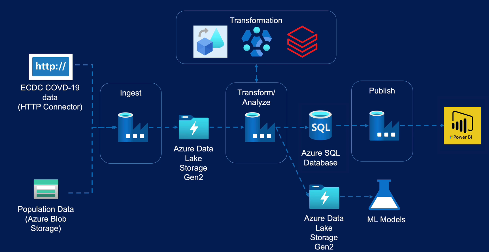

# AzureDataEngineering-ECDC-CovidSpread
 
# Project: Azure Data Engineering for Disease Spread Insights

## Overview
This project focuses on building a comprehensive data platform to analyze disease spread insights, with a particular emphasis on COVID-19. The platform ingests data from various sources, including the European Center for Disease Prevention and Control (ECDC) for COVID-19 data and Eurostat for population data. The data is processed and transformed using Azure Data Factory, HDInsight, and Azure Databricks, and stored in Azure Data Lake Storage Gen2. The transformed data is then used for machine learning models and reporting using Azure SQL Database and Power BI.

## Architecture Overview
The solution architecture consists of several key components:
- **Data Ingestion**: COVID-19 data is obtained from the ECDC website using the HTTP connector in Azure Data Factory, while Eurostat population data is stored in Azure Blob Storage and ingested from there.
- **Data Transformation**: Azure Data Factory is used for data transformation, leveraging Data Flows for simpler transformations and HDInsight/Azure Databricks for more complex ones.
- **Storage Solutions**: Azure Blob Storage is used for population data, Azure Data Lake Storage Gen2 serves as the Data Lake, and Azure SQL Database is utilized as the data warehouse solution.
- **Reporting**: Power BI is used to create meaningful reports and visualize trends derived from the processed data.

## Technologies Used
- **Azure Data Factory**: for data integration and orchestration.
- **Azure HDInsight**: for scalable data processing using Hadoop-based technologies.
- **Azure Databricks**: for distributed data processing and analytics.
- **Azure Blob Storage**: for storing population data.
- **Azure Data Lake Storage Gen2**: as the centralized storage solution for processed data.
- **Azure SQL Database**: for data warehousing and reporting.
- **Power BI**: for creating insightful reports and visualizations.

