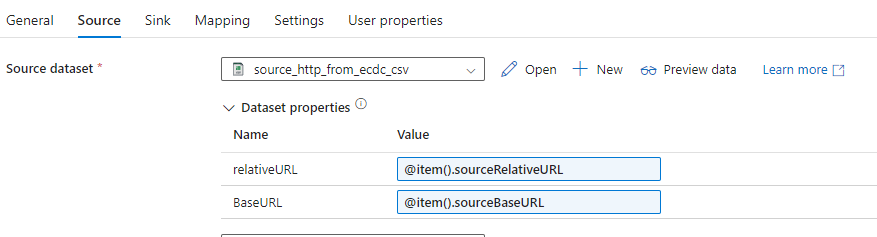
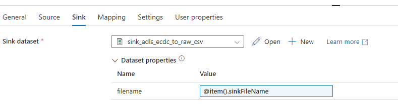
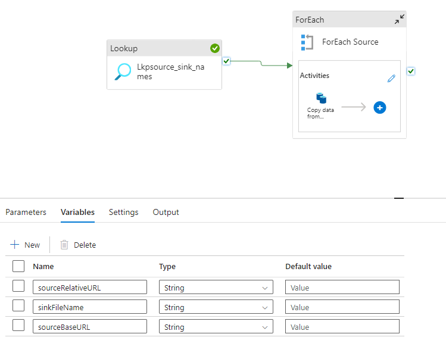

# Data Ingestion - ECDC Website to Azure ADLS Gen2

This section has details of data integration from ECDC website to Azure ADLS Gen2

## Data Ingestion Requirements

1) Covid19 - new cases deaths by country
2) Hospital admissions and ICU cases
3) Testing Numbers
4) Country Response to Covid-19

All these 4 data are fetched from the below URLs 

1) https://www.ecdc.europa.eu/en/covid-19/data

2) https://opendata.ecdc.europa.eu/covid19/nationalcasedeath/csv/data.csv

3) https://opendata.ecdc.europa.eu/covid19/hospitalicuadmissionrates/csv/data.csv

4) https://opendata.ecdc.europa.eu/covid19/testing/csv/data.csv

5) https://www.ecdc.europa.eu/sites/default/files/documents/response_graphs_data_2022-08-25.csv
   
   Data Dictionary for response graphs: 
   https://www.ecdc.europa.eu/sites/default/files/documents/Variable_Dictionary_and_Disclaimer_non-pharmacautical_measures_v3.pdf

The file **ecdc_data_set_list.json** is fed through a Lookup activity. 
Lookup activity is followed by ForEach activity. This ForEach activity contains copy activity (which has configurations to sink data from HTTP to ADLS Gen2).

So Copy Activity is run for every item(value) in the file to sink data from ECDC to Azure ADLS Gen 2 container.

## Variables used in the pipeline

### Copy activity

#### Source

#### Sink

### Pipeline Variables

