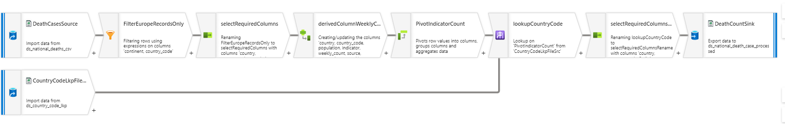
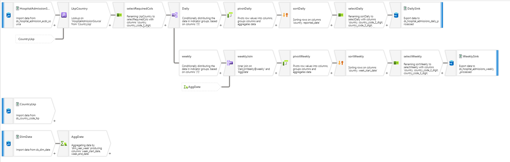

# Cases and deaths data transformation using Mapping data flow

## Transformations Used

1) **Source transformation** - Source from Raw (national_death_Cases.csv)
2) **Filter transformation** - to filter Europe records
3) **Select transforamtion** - to rename few columns
4) **Pivot transformation** - pivot indicator(deaths, cases) and count columns to case_count and death_count
5) **Derived column transformation** - data cleansing
6) **LookUp Transforamtion** - to fetch country codes
7) **Sink transformation** - Target in ADLS csv file

### Below is the mapping data flow screenshot:

# Hospital admissions - daily and weekly Mapping data flow

